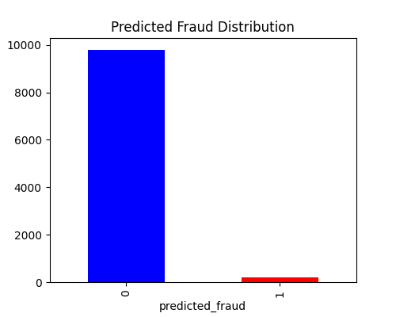
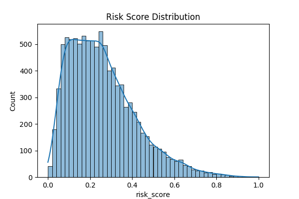

# Fraud Detection using Machine Learning

# Project Overview

This project detects fraudulent transactions using both:

* Isolation Forest (unsupervised anomaly detection)
* Logistic Regression (supervised classification)

The dataset is highly imbalanced (~1.5% fraud), so the focus is on optimizing precision and recall instead of accuracy.


# Approach

* Data preprocessing and feature scaling (StandardScaler)
* Anomaly detection using Isolation Forest
* Probability-based classification using Logistic Regression
* Threshold tuning to balance fraud detection vs false positives


# Final Results (Logistic Regression - Threshold = 0.8)

* Precision (Fraud): **0.13**
* Recall (Fraud): **0.40**
* F1 Score: **0.19**

Confusion Matrix:
[[9435  414]
 [  91   60]]


# Key Insight

Lower thresholds increased fraud detection but caused too many false positives.
Threshold = 0.8 provided the best trade-off for practical use.


# Tools & Technologies
* Python
* Pandas & NumPy
* Scikit-learn
* Matplotlib & Seaborn
* VS Code


## Project Structure

```
Fraud_Detection_Project/
│
├── data/
│   └── transactions.csv
├── scripts/
│   └── fraud_detection.py
├── output/
│   └── fraud_results.csv
├── dashboard/
│   ├── fraud_distribution.png
│   └── risk_score.png
├── README.md


## Key Features
* Data cleaning and preprocessing
* Feature selection and scaling
* Anomaly detection using Isolation Forest
* Risk scoring for transactions
* Model evaluation using classification metrics
* Visualization of fraud patterns
* Identification of high-risk transactions


## Model Used
* **Isolation Forest (Unsupervised Learning)**
  * Detects anomalies based on data distribution
  * Works well for imbalanced datasets


## Model Performance
* Evaluated using:
  * Accuracy
  * Precision
  * Recall
  * Confusion Matrix
Fraud detection is an imbalanced problem, so recall is more important than accuracy.


## Visualizations
### 🔹 Fraud Distribution

### 🔹 Risk Score Distribution



## Key Insights
* High-value transactions are more likely to be fraudulent
* Transactions with high velocity (frequency) show higher risk
* Only a small percentage of transactions are fraud (imbalanced data)
* Risk score helps prioritize suspicious transactions


## How to Run
1. Clone the repository:
```
git clone https://github.com/yourusername/fraud-detection-project.git
```

2. Navigate to the folder:
```
cd Fraud_Detection_Project
```

3. Install dependencies:
```
pip install pandas numpy matplotlib seaborn scikit-learn
```

4. Run the script:
```
python scripts/fraud_detection.py
```


## Output
* fraud_results.csv` → Contains transaction predictions and risk scores
* Dashboard images → Visualizations of fraud patterns and risk distribution


## Future Improvements
- Implement advanced models (Random Forest, XGBoost)
- Perform hyperparameter tuning for better accuracy
- Build real-time fraud detection system
- Develop interactive dashboard using Streamlit or Power BI


##  Contact
Feel free to reach out for any questions or collaboration opportunities.
